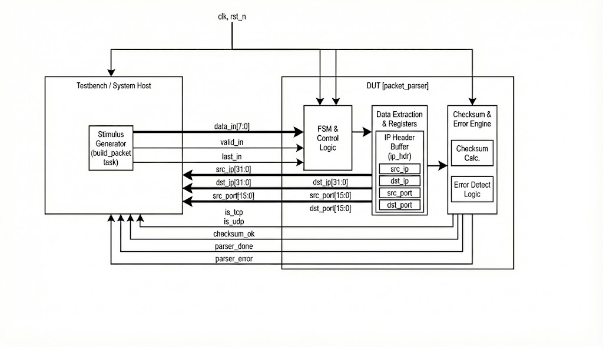
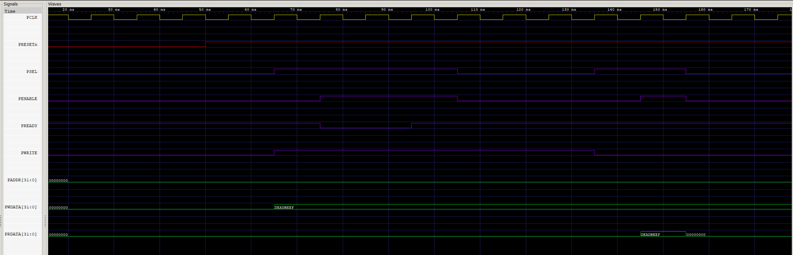

# FSM-based Packet Parser Accelerator (Ethernet/IPv4/TCP/UDP)

## 1. Introduction
This project implements a high-speed, hardware-based **stateful packet parser** in SystemVerilog. The design parses a byte-stream Ethernet frame, detects IPv4 traffic, extracts key IPv4 + TCP/UDP fields, and validates the IPv4 header checksum.

The core is a **6-state FSM** with a lightweight datapath for extraction and checksum verification. The module is intended for SoC datapaths, hardware firewalls, and packet inspection accelerators.


## 2. Key Features
- **Ethernet + IPv4 detection:** Checks EtherType (`0x0800`) before entering IP parsing.
- **Protocol identification:** Detects and flags:
  - TCP (`0x06`)
  - UDP (`0x11`)
- **Real-time extraction:**
  - `src_ip`, `dst_ip` (32-bit)
  - `src_port`, `dst_port` (16-bit)
- **IPv4 header checksum verification:**
  - Buffers the IPv4 header (`ip_hdr`)
  - Calculates checksum with **1’s complement sum**, with **end-around carry folding**
  - Compares against the checksum field in the header
- **Robust error handling:**
  - Detects early termination of Ethernet/IP/L4 regions
  - Rejects invalid IPv4 version / IHL
  - Safely drains unsupported traffic until `last_in`
- **Stable sampling for verification:**
  - `checksum_ok` is **registered** (`checksum_ok_r`) and latched on entry to `DONE`
  - Checksum latching uses **cycle-accurate error detection** (`err_this_cycle`) to avoid stale timing issues


## 3. Architecture Overview
The design is split into:
- **Control Path:** FSM controlling parsing flow and byte offsets
- **Data Path:** Field extraction + checksum verification



### 3.1 Finite State Machine (FSM)
The parser uses 6 states:

1. **IDLE**
   - Waits for `valid_in`
   - Resets per-packet status (e.g., clears `checksum_ok_r` at packet start)

2. **PARSE_ETH**
   - Tracks bytes in the Ethernet header
   - On byte 12–13, checks EtherType:
     - If `0x0800` → `PARSE_IP`
     - Otherwise → `WAIT_END`

3. **PARSE_IP**
   - Buffers header bytes into `ip_hdr`
   - Validates:
     - Version must be 4
     - IHL must be ≥ 5
   - Computes header length: `ip_len_bytes = IHL * 4`
   - Extracts:
     - Protocol at byte offset 9
     - `src_ip` at offsets 12–15
     - `dst_ip` at offsets 16–19
   - At end of header:
     - If protocol is TCP/UDP → `PARSE_L4`
     - Else → `WAIT_END`

4. **PARSE_L4**
   - Extracts:
     - `src_port` from first 2 bytes
     - `dst_port` from next 2 bytes
   - Then transitions to `WAIT_END` to drain payload

5. **WAIT_END**
   - Consumes bytes until `valid_in && last_in`
   - Then goes to `DONE`

6. **DONE**
   - Indicates parsing completion
   - `parser_done` is asserted when `current_state == DONE`
   - `checksum_ok_r` is latched *exactly when entering DONE*

### 3.2 Pipeline & Latency Profile
The parser operates as a streaming processor with minimal overhead. The latency from the last byte of a packet to the valid output is **1 clock cycle**.

**Textual Pipeline Diagram:**
```text
Cycle n:      [data_in (Last Byte)] --> FSM: PARSE_L4/WAIT_END --> Latch Ports/IP
Cycle n+1:    [FSM: DONE]           --> Checksum Calculated    --> valid_out (High)
                                                               --> checksum_ok (Latched)

```

## 4. Checksum Engine (IPv4 Header)
Checksum logic is TB-matched and works as follows:
- Reads checksum field: `hdr_checksum = {ip_hdr[10], ip_hdr[11]}`
- Sums 16-bit words across the IPv4 header
- Treats the checksum field as `0x0000` during calculation
- Folds carries until the upper 16 bits are zero
- Takes 1’s complement: `calc_checksum = ~sum1[15:0]`
- `checksum_ok_r` is latched on transition into `DONE`:
- `checksum_ok_r = (calc_checksum == hdr_checksum) && no_error`


### 4.1 Cycle-Accurate Error for Checksum Latching
To avoid latching checksum with a **stale** `parser_error` value, the design includes:
- `err_this_cycle` (combinational)
- `parser_error` updates as: `parser_error <= parser_error | err_this_cycle`
- Checksum latch uses:
- `!(parser_error || err_this_cycle)` so a newly-detected error is reflected immediately.

### 4.2 Design Considerations & Trade-offs
A key architectural decision in this parser is the **Buffered Checksum Approach** versus an **On-the-fly** calculation.

* **Buffered Logic:** By storing the IPv4 header (up to 60 bytes) in the `ip_hdr` register array, the engine ensures that checksum validation only occurs once the full header context is available. This simplifies error recovery if a packet is truncated mid-header.
* **Hardware Impact:** While utilizing registers for buffering increases the total Flip-Flop count (Area), it provides stable timing for field extraction. 
* **Timing Optimization:** In the current version, the checksum is calculated using a combinational sum. For high-target frequencies , this logic can be further refactored into a **Pipelined Adder Tree** to reduce the critical path delay between the buffer and the final result.

### 4.3 Scaling for High-Frequency Targets
To achieve higher clock frequencies , the combinational logic for checksum and field extraction can be deeply pipelined:

1.  **Pipelined Adder Tree:** Instead of a single-cycle combinational sum of 30 x 16-bit words, the calculation can be split across 3-4 pipeline stages.
2.  **On-the-fly Partial Sums:** Instead of buffering the whole header, we can calculate partial 16-bit sums as bytes arrive. This reduces the large XOR/Adder tree at the end of the packet to a single addition.
3.  **Output Retiming:** Adding register stages to the `src_ip`, `dst_ip`, and `ports` outputs to decouple the parser's internal datapath from the downstream logic's setup time requirements.

## 5. Interface Description

| Signal Group | Signal Name | Direction | Width | Description |
| :--- | :--- | :--- | :--- | :--- |
| **Global** | `clk` | Input | 1 | Rising-edge clock |
| | `rst_n` | Input | 1 | Asynchronous active-low reset |
| **Stream In** | `valid_in` | Input | 1 | `data_in` is valid this cycle |
| | `data_in` | Input | 8 | Streaming byte input |
| | `last_in` | Input | 1 | End-of-packet marker |
| **Extraction** | `src_ip / dst_ip` | Output | 32 | Extracted IPv4 addresses |
| | `src_port / dst_port` | Output | 16 | Extracted TCP/UDP ports |
| | `is_tcp / is_udp` | Output | 1 | Protocol flags |
| **Status** | `parser_done` | Output | 1 | High when in DONE state (completion indicator) |
| | `parser_error` | Output | 1 | High if malformed / early termination detected |
| | `checksum_ok` | Output | 1 | Registered checksum result, latched on DONE entry |


## 6. Verification & Testing
The included self-checking SystemVerilog testbench (`tb_packet_parser.sv`) generates Ethernet+IPv4 frames and validates behavior.

### Functional Scenarios Verified
1. **Valid TCP Stream**
   - Verifies extracted IPs and checksum success
2. **Corrupt Checksum Injection**
   - Modifies checksum to ensure `checksum_ok` deasserts
3. **Early Termination**
   - Sends a short packet to ensure `parser_error` asserts
4. **ICMP / Unsupported Protocol Handling**
   - Ensures no TCP/UDP flags are asserted
   - Parser drains until `last_in`




## 7. Tools Used
- **Language:** SystemVerilog (IEEE 1800)
- **Simulator:** Icarus Verilog (`iverilog`)
- **Waveform Viewer:** GTKWave


## 8. How to Run Simulation

```bash
# 1. Compile the design and testbench
iverilog -g2012 -o parser_sim packet_parser.sv tb_packet_parser.sv

# 2. Run the simulation
vvp parser_sim

# 3. View waveforms (optional)
gtkwave dump.vcd